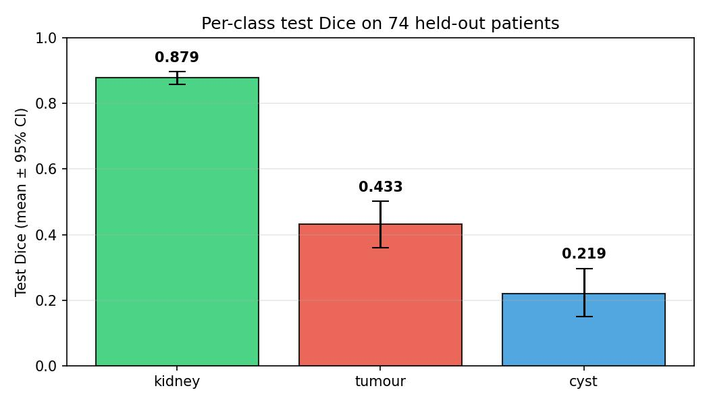
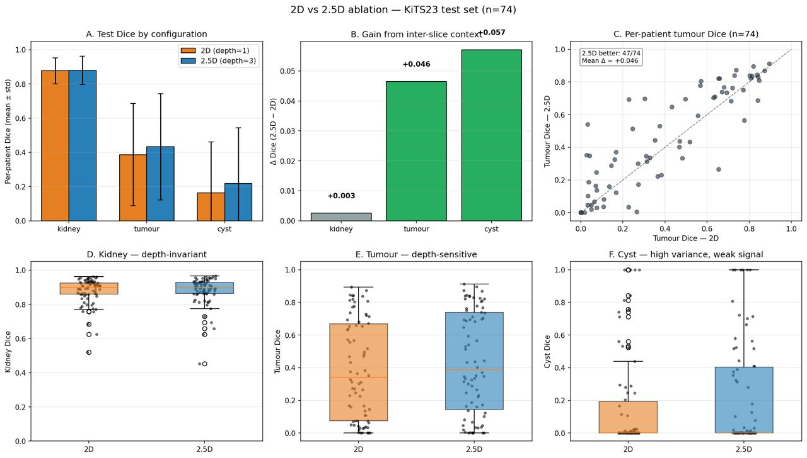
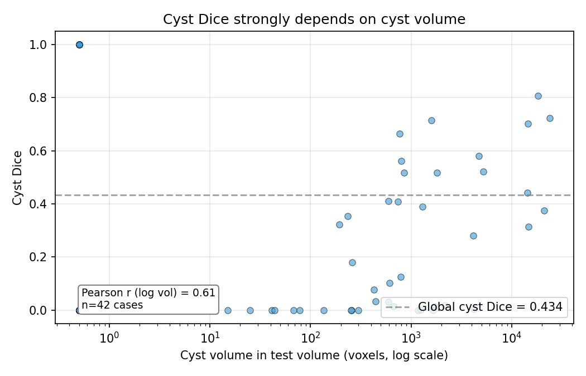
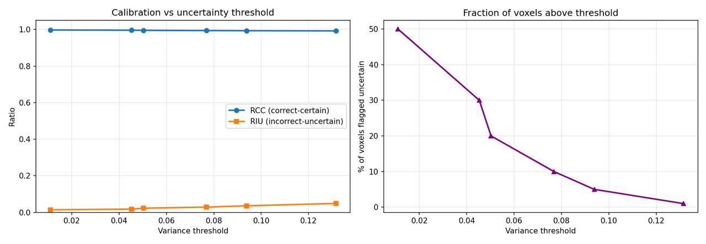
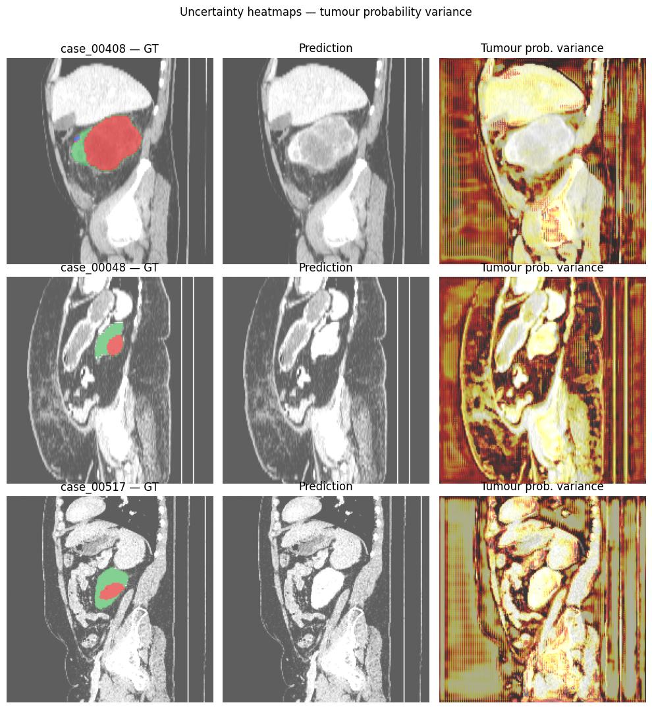

# Kidney, Tumour & Cyst Segmentation on KiTS23: 2.5D U-Net with MC Dropout Uncertainty

BSc thesis code, American International University-Bangladesh (AIUB), Fall 2025-26.

An image-only, reproducible baseline for segmenting kidney, tumour and cyst in contrast-enhanced CT (KiTS23), with a controlled 2D vs 2.5D ablation and post-hoc Monte Carlo Dropout uncertainty.

## Highlights

- **Model:** 2D U-Net, 3-slice axial stack as 3 input channels, 7,763,140 params
- **Training:** 40 epochs, 192x192 slices, HU windowing, per-volume z-score, foreground-biased slice sampling, seed 42
- **Split:** deterministic patient-level 342 / 73 / 74 (train / val / test), stratified by tumour presence
- **Uncertainty:** MC Dropout (p = 0.3, 20 passes)
- **Hardware:** single NVIDIA A100 80GB (Google Colab)

## Results (74 held-out test patients)

| Class | Per-patient Dice [95% CI] | Global voxel Dice (stride 12) |
|---|---|---|
| Kidney | 0.879 [0.858, 0.897] | 0.879 |
| Tumour | 0.433 [0.359, 0.501] | 0.672 |
| Cyst | 0.219 [0.150, 0.297] | 0.434 |

Per-patient Dice is computed on **every** axial slice of each patient. Global voxel Dice and the confusion matrix use a stride of 12 (every 12th slice), so they are strided-sample estimates, not full-volume estimates. The two columns answer different questions and are not directly comparable.

**Depth ablation (2.5D vs 2D, per-patient):** +0.003 kidney Dice, +0.046 tumour Dice; 2.5D better on 47/74 patients for tumour. The depth-1 model is trained inside the same notebook, following the test evaluation section. Raw values are in `results/ablation/` (`ablation_summary.csv`, `ablation_per_class.csv`).

**Uncertainty:** RCC_cal (reliability-confidence ratio) = 0.994, error-detection AUC = 0.861 (predictive entropy) and 0.749 (variance of tumour probability). Thresholded uncertainty does not isolate errors (RIU < 0.05), so it is useful for *ranking* cases for review, not for hard thresholding. (In `calibration_metrics.csv` the RCC_cal column is headed `RCC`.)

**Cyst analysis:** per-patient cyst Dice correlates with log cyst volume (Pearson r = 0.61, n = 42). Failure is mainly a resolution and class-imbalance limitation, not purely architectural.

## Repo layout

```
kits23_segmentation_FINAL.ipynb   # preprocessing, 2.5D training, test eval, MC Dropout, analysis, 2D ablation
splits/                           # patient-level train/val/test split files
models/                           # trained checkpoints (unet2d_baseline.pth)
results/                          # tables and figures: segmentation/, ablation/, uncertainty/
requirements.txt
LICENSE
```

`data/`, `cache/` and `seg_cache/` are git-ignored. KiTS23 volumes and cached slices are never committed.

## Setup

```bash
python -m venv .venv
source .venv/bin/activate
pip install -r requirements.txt
```

`requirements.txt` pins `torch==2.11.0`; the model was trained under `2.11.0+cu128`. Install a CUDA-enabled build if training on GPU.

## Data

KiTS23 is publicly distributed:

- **Official repository:** https://github.com/neheller/kits23
- **HuggingFace mirror used by the notebook:** https://huggingface.co/datasets/MedOtter/kits23 (imaging and segmentation files only)

The notebook downloads the mirror itself (cell C1) into `DATASET_DIR`. The preprocessing cache is regenerated automatically on first run.

## Usage

Open `kits23_segmentation_FINAL.ipynb` in **Google Colab** (it mounts Google Drive and uses `/content/...` paths; edit cells C0.5 and C2 to run locally). Training was done on a Colab A100; a smaller GPU will need a reduced batch size. The notebook builds the cached slices, trains the 2.5D U-Net, evaluates on the 74-patient test split, and runs MC Dropout.

**Note on running order:** One intermediate MC-Dropout post-processing cell is not included in the exported notebook (see *Reproducibility* below). Cells C0–C11 and C13–C14 run as-is; cell C12 requires the missing intermediate step. All final calibration CSVs and figures are already present in `results/`, so the notebook does not need to be re-run to reproduce the numbers reported in the thesis.

## Limitations

- Image-only, single compact model; the KiTS23 winning solution is an ensemble of 15 models (10 SegResNet + 5 DiNTS) trained on an 8-GPU machine. Its Dice (0.835, averaged over three overlapping regions on the hidden test set) is not directly comparable to the per-class numbers here
- Tumour and cyst per-patient Dice remain low; small lesions suffer at 192x192 resolution
- Single split, single seed
- Segmentation masks are resampled with bilinear interpolation plus rounding (not nearest-neighbour) to keep small lesions; the two modes were not compared
- Global voxel Dice uses a stride of 12 (compute trade-off); per-patient Dice uses full volumes
- MC Dropout layers are injected post-hoc after every ReLU, so the effective dropout rate is higher than the nominal p = 0.3. The effective rate was not measured; p = 0.3 is the configured value throughout

## Reference

Heller et al., KiTS23 dataset: https://github.com/neheller/kits23

## License

Code: MIT (see `LICENSE`). KiTS23 data is governed by its own license and is not covered by this repository's license.

## Figures

Per-class test Dice (74 held-out patients):



2D vs 2.5D depth ablation:



Cyst Dice vs cyst volume (Pearson r = 0.61):



MC Dropout calibration vs uncertainty threshold:



Uncertainty heatmaps (tumour probability variance):



All figures and CSV tables are in [`results/`](results/): `segmentation/`, `ablation/`, `uncertainty/`.

## Reproducibility

- **Splits:** `splits/{train,val,test}_ids.txt` hold the 342 / 73 / 74 patient IDs (70/15/15, stratified by tumour presence, seed 42).
- **Weights:** `models/unet2d_baseline.pth` is the best-epoch 2.5D U-Net (3-channel input, 7,763,140 parameters). Load it with `model.load_state_dict(torch.load(path))`. The depth-1 ablation model (7,762,564 parameters) is saved by the notebook as `model_final.pth` in its ablation output folder.
- **Not in the repo:** KiTS23 volumes, cached slices, and the per-voxel MC Dropout outputs (about 4.7 GB compressed). The exported notebook contains the MC Dropout inference cell (C11) and the final calibration/AUC cells (C12–C13), but the intermediate cell that flattens `mc_results` into per-voxel arrays (`all_var`, `all_correct`, `all_entropy`, `calib_rows`) is not included. The final CSV outputs are preserved in `results/uncertainty/`; regenerating them would require re-adding that intermediate step.
- **Environment:** pinned in `requirements.txt` (versions from Google Colab, where the model was trained).

## Authors

Abdullah Al Noman, Md. Irfan Hossain, Abir Ahosan Ratul, Md. Fahim Siddiki. Supervisor: Supta Richard Philip, Department of Computer Science, AIUB.
